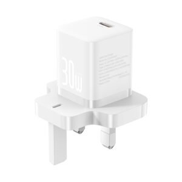

# FH Online Store 🛒✨

Welcome to the **FH Online Store**, your premium destination for high-quality Baseus electronics, earbuds, chargers, and power banks! 

Built with Flask and designed with stunning modern glassmorphism aesthetics, this platform provides an incredibly smooth, fast, and responsive shopping experience.

---

## 🌟 Key Features
- **Premium Glassmorphism UI**: Beautifully designed transparent elements, soft blurs, and micro-animations.
- **Live Search & Filtering**: Easily search for products or filter them by category (e.g. *New Arrivals, Power Banks, Audio, Chargers*).
- **Product Details & Warranties**: Get full descriptions and warranty tags on product pages.
- **WhatsApp Checkout System**: No complex payment gateways. Simply add items to your cart and send your entire order via WhatsApp!
- **Automated Data Scraping**: Powered by a Python script that seamlessly syncs thousands of LKR prices and products directly from Baseus Colombo.

---

## 📸 Product Showcase

Here are just a few of the high-quality items available in our store:

  
  
  

---

## 🛍️ How to Place an Order

Placing an order is extremely simple and fast! Follow these 3 easy steps:

### 1. Browse and Add to Cart
Browse through the collections or use the search bar to find what you want. Click **View Details** and then click the **Add to Cart** button.
*(A notification will pop up confirming the item is in your cart!)*

### 2. View Your Cart
Click the **🛒 Cart Icon** at the top right of the navigation menu. Here you can:
- Review your items
- Increase or decrease quantities `+` / `-`
- See your total price in LKR.

### 3. Order via WhatsApp 📱
Once you are happy with your cart, click the green **Order via WhatsApp** button on the right side. 

This will automatically open your WhatsApp application with a **pre-filled message** containing your exact order, quantities, and total price. Just hit "Send" to forward the message to our team, and we will arrange the delivery and payment with you directly!

---

### Tech Stack
* **Backend**: Python, Flask, SQLAlchemy, SQLite
* **Frontend**: HTML5, Vanilla CSS (Glassmorphism), JavaScript
* **Data Processing**: BeautifulSoup4, Requests (for scraping)

*Developed for the best customer shopping experience!*
